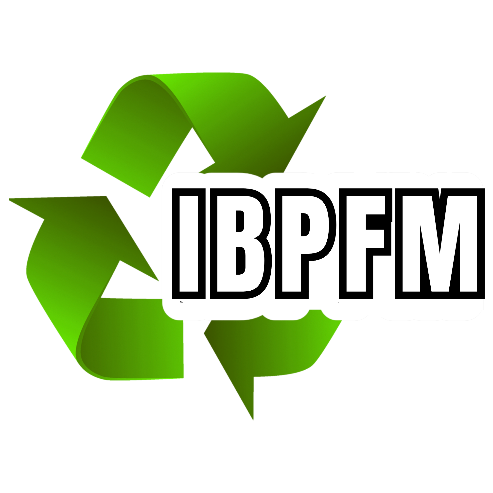
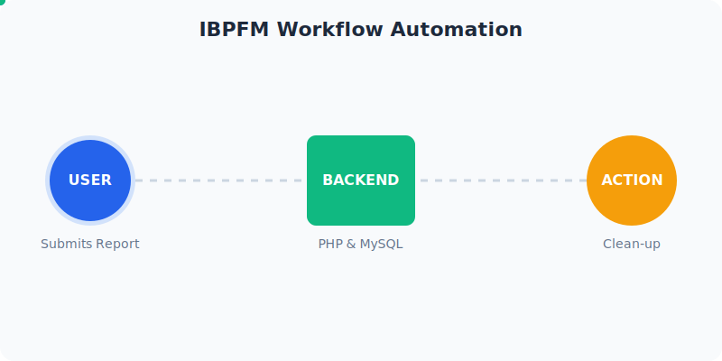

# IBPFM - Intelligence Based Pollution Free Mission



## 🔄 System Workflow



**IBPFM** (Intelligence Based Pollution Free Mission) is a comprehensive web platform dedicated to environmental awareness, education, and action. Developed for **Sparkathon24**, this project aims to empower communities to combat pollution through technology and intelligence.

## 🌟 Key Features

### 1. 🤖 ECO AI Assistant
A built-in AI chatbot (powered by Google Gemini) designed to answer environmental queries. Whether it's sewage treatment, air quality index, or plastic waste management, ECO AI provides context-aware information to help nature.

### 2. 📊 Real-time Pollution Monitoring
The home page features a live AQI (Air Quality Index) monitor using the WAQI API, identifying the most polluted city in India in real-time to raise immediate awareness.

### 3. 📢 Community Reporting System
A robust reporting workflow that allows users to report illegal dump sites or polluted areas in their locality.
- **Form Submission**: Users can submit locations and descriptions of junk piles.
- **Admin Management**: Dedicated PHP backend to view and manage these reports for community cleanup actions.

### 4. 📚 Environmental Learning Hub
A structured educational section containing:
- **10 Core Topics**: Deep dives into why pollution occurs, its health impacts, and global solutions.
- **Certified Courses**: Links to professional courses from providers like Udemy, Alison, and Coursera.
- **Government Directory**: A curated list of government-provided environmental science and policy programs in India.

## 📁 Project Structure

```text
IBPFM/
├── index.html            # Landing page with AQI monitor
├── ai.html               # ECO AI interface
├── report.html           # Pollution reporting form
├── learn.html            # Learning hub introduction
├── aboutus.html          # Team information & Mission
├── gov.html              # Government & Certified courses
├── success.html          # Submission confirmation
├── php/                  # Backend Logic
│   ├── db_connect.php    # Centralized MySQL connection
│   ├── submit_report.php # Report processing script
│   └── view-reports.php  # Report management dashboard
├── topics/               # Educational Modules (Topics 1-10)
├── css/                  # Styling assets
├── img/                  # Graphic assets
├── sql/                  # Database management
│   └── setup.sql         # Database schema
└── PROJECT_STRUCTURE.md  # Detailed technical roadmap
```

## 🛠️ Technology Stack

- **Frontend**: HTML5, Vanilla CSS, JavaScript (ES6+)
- **Backend**: PHP (7.4+)
- **Database**: MySQL / MariaDB
- **APIs**: 
  - Google Gemini API (Natural Language Processing)
  - WAQI API (Real-time AQI data)
  - Google reCAPTCHA (Security)

## 🚀 Getting Started

1.  **Database Setup**: 
    - Import `sql/setup.sql` into your MySQL server.
    - Configuration can be adjusted in `php/db_connect.php`.
2.  **Web Server**: 
    - Host the files on a server supporting PHP (e.g., XAMPP, Apache).
3.  **API Keys**: 
    - The project uses a demonstration Gemini API key. For production, replace the key in `ai.html`.

## 👥 Meet the Team (Bot With Dot)

- **Sowmiyan S** - developer
- **Sathwik N** - developer
- **Sudarson B** - developer
- **Vishal** - developer

---
*Developed with ❤️ for a cleaner, greener planet.*
